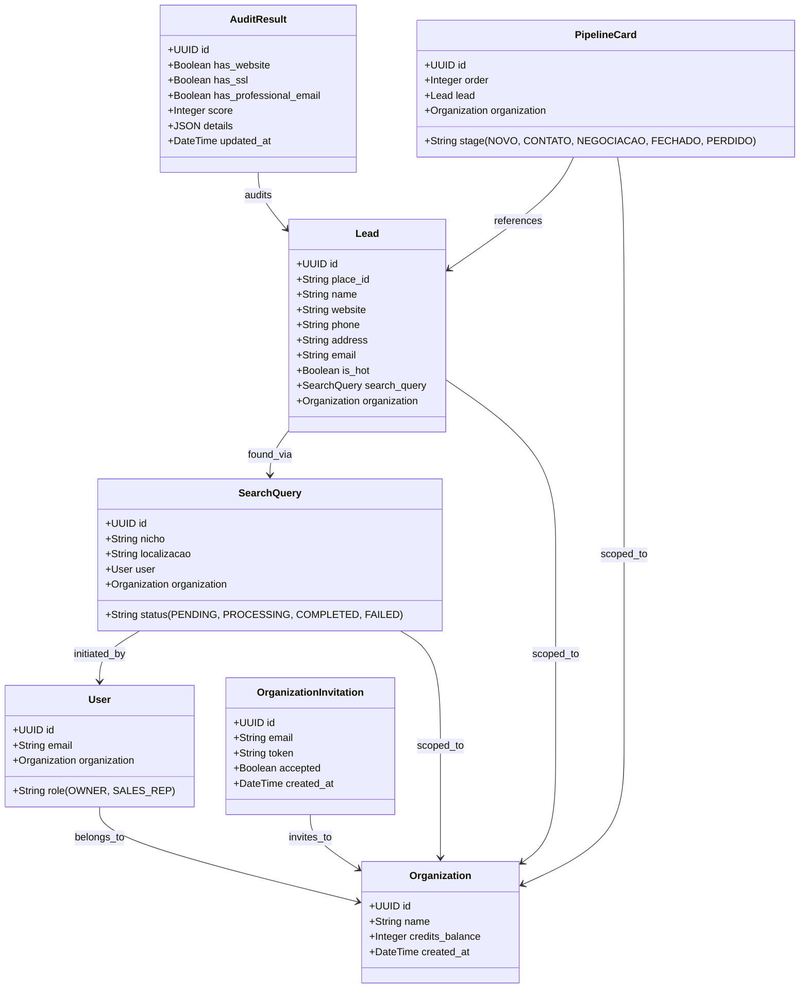

# LeadScout AI - Technical Design Specification

This design document outlines the architecture, database schema, and operational flows for the V1 release of LeadScout AI, a SaaS platform for active B2B sales intelligence.

---

## 1. System Overview

LeadScout AI enables B2B sales agencies, marketing professionals, and freelancers to search for local businesses, perform automated technical audits of their digital presence (website existence, SSL status, email domain professionalization), assign a business urgency score, organize leads in a mini-CRM pipeline, and generate customized AI outreach scripts.

---

## 2. Multi-Tenancy & Database Schema

Multi-tenancy is enforced at the database level by partitioning all lead, query, and pipeline records using an `organization_id` foreign key.

### Entity Relationship Diagram



### Model Specifications

#### accounts App Updates

*   **`Organization`**:
    *   `id`: `BigAutoField` or standard integer primary key.
    *   `name`: `CharField(max_length=255)` - Name of the agency/tenant.
    *   `credits_balance`: `PositiveIntegerField(default=10)` - Shared credits for searches.
    *   `created_at`: `DateTimeField(auto_now_add=True)`
    *   `updated_at`: `DateTimeField(auto_now=True)`

*   **`User`** (Extends custom AbstractUser):
    *   `organization`: `ForeignKey(Organization, on_delete=models.SET_NULL, null=True, blank=True, related_name='members')`
    *   `role`: `CharField(max_length=20, choices=[('OWNER', 'Dono'), ('SALES_REP', 'Vendedor')], default='OWNER')`

*   **`OrganizationInvitation`**:
    *   `organization`: `ForeignKey(Organization, on_delete=models.CASCADE)`
    *   `email`: `EmailField()`
    *   `token`: `CharField(max_length=64, unique=True)`
    *   `accepted`: `BooleanField(default=False)`
    *   `created_at`: `DateTimeField(auto_now_add=True)`

#### leads App (New App)

*   **`SearchQuery`**:
    *   `organization`: `ForeignKey(Organization, on_delete=models.CASCADE, related_name='search_queries')`
    *   `user`: `ForeignKey(settings.AUTH_USER_MODEL, on_delete=models.SET_NULL, null=True)`
    *   `nicho`: `CharField(max_length=100)`
    *   `localizacao`: `CharField(max_length=150)`
    *   `status`: `CharField(max_length=20, choices=[('PENDING', 'Pendente'), ('PROCESSING', 'Processando'), ('COMPLETED', 'Concluído'), ('FAILED', 'Falhou')], default='PENDING')`
    *   `created_at`: `DateTimeField(auto_now_add=True)`

*   **`Lead`**:
    *   `organization`: `ForeignKey(Organization, on_delete=models.CASCADE, related_name='leads')`
    *   `search_query`: `ForeignKey(SearchQuery, on_delete=models.SET_NULL, null=True, blank=True, related_name='leads')`
    *   `place_id`: `CharField(max_length=255, blank=True, null=True)`
    *   `name`: `CharField(max_length=255)`
    *   `website`: `URLField(blank=True, null=True, max_length=500)`
    *   `phone`: `CharField(max_length=50, blank=True, null=True)`
    *   `address`: `TextField(blank=True, null=True)`
    *   `email`: `EmailField(blank=True, null=True)`
    *   `is_hot`: `BooleanField(default=False)`
    *   `created_at`: `DateTimeField(auto_now_add=True)`

*   **`AuditResult`**:
    *   `lead`: `OneToOneField(Lead, on_delete=models.CASCADE, related_name='audit')`
    *   `has_website`: `BooleanField(default=False)`
    *   `has_ssl`: `BooleanField(default=False)`
    *   `has_professional_email`: `BooleanField(default=False)`
    *   `score`: `PositiveIntegerField(default=0)`
    *   `details`: `JSONField(default=dict)` - Stores technical audit details (SSL error logs, emails scraped, status codes, etc.)
    *   `updated_at`: `DateTimeField(auto_now=True)`

*   **`PipelineCard`**:
    *   `organization`: `ForeignKey(Organization, on_delete=models.CASCADE, related_name='pipeline_cards')`
    *   `lead`: `OneToOneField(Lead, on_delete=models.CASCADE, related_name='pipeline_card')`
    *   `stage`: `CharField(max_length=30, choices=[('NOVO', 'Novo'), ('CONTATO', 'Em Contato'), ('NEGOCIACAO', 'Negociação'), ('FECHADO', 'Fechado'), ('PERDIDO', 'Perdido')], default='NOVO')`
    *   `order`: `PositiveIntegerField(default=0)`
    *   `updated_at`: `DateTimeField(auto_now=True)`

---

## 3. Core Operational Flows

### Search and Audit Orchestration

The search engine acts asynchronously using **Celery + Redis** with a fail-safe fallback to standard python **threading/synchronous inline execution** if Celery is not running.

1.  **Credit Verification**: Before initiating a search, the views check:
    *   `organization.credits_balance >= 1`
    *   If insufficient, it triggers a blocking Paywall overlay.
2.  **Transaction**: If credits are available, `credits_balance` is decremented by 1. A `SearchQuery` is saved as `PENDING`.
3.  **Google Maps Search**: The Serper client (`services.py`) queries `https://google.serper.dev/maps` with `"{nicho} in {localizacao}"`.
4.  **Auditor Engine**:
    *   For each place returned, a `Lead` is saved.
    *   An audit is launched.
    *   **Rule 1 (Site Existence)**: Tries to connect to the URL. If DNS/HTTP connection fails or timeout, `has_website = False`.
    *   **Rule 2 (SSL Certification)**: Checks if HTTPS connection is secure. If certificate validation fails or connection errors, `has_ssl = False`.
    *   **Rule 3 (Professional Email)**: If the site exists, downloads the homepage HTML (strict 5s timeout) and searches for emails using Regex. If any email is found:
        *   If the email domain belongs to a generic provider (e.g. `gmail.com`, `hotmail.com`, `yahoo.com`, `outlook.com`), `has_professional_email = False`.
        *   Otherwise: `has_professional_email = True`.
5.  **Scoring Calculation**:
    *   `No Website`: `+50` points.
    *   `No SSL`: `+30` points (applied if site doesn't exist, or exists but fails SSL validation).
    *   `Generic/Missing Email`: `+20` points (applied if no email was found, or if the email found is generic).
    *   Leads with a total of `100` points are flagged `is_hot = True` ("Oportunidade de Ouro").

### Local Mock Fallbacks
To enable seamless development and testing when API keys are missing:
*   **Missing `SERPER_API_KEY`**: The service yields a list of 10 static mock local establishments reflecting different business types and audit scenarios (e.g. 1 hot lead, 2 SSL-missing leads, etc.).
*   **Missing `OPENAI_API_KEY`**: The AI outreach writer responds instantly with high-quality, pre-compiled templates dynamically filled with lead attributes matching their specific audit deficiencies.

---

## 4. Sales Script Prompt Specifications

The system prompt for generating scripts ensures the focus is on client-side business impact rather than dry technical terms.

```
Você é um especialista em vendas B2B de alta performance. 
Gere um script de abordagem fria de 3 parágrafos focado na dor do cliente.
Use os seguintes dados da auditoria técnica da empresa:
- Nome: {lead_name}
- Website: {website_status} (Sem site, Sem SSL, ou Ok)
- E-mail: {email_status} (Não profissional ou Profissional)
- Score de Urgência: {score}/100

Regras:
1. Tom profissional, amigável e focado em gerar valor imediatamente.
2. Não cite pontuações ou jargões técnicos complexos; foque nos impactos de negócios (perda de clientes, falta de segurança, falta de credibilidade).
3. Termine com uma chamada de ação (CTA) simples e direta para uma conversa de 10 minutos.
```

---

## 5. UI Layout and User Experience

*   **Dark Mode Theme**: Dark mode is standard, incorporating vibrant neon accents (green/blue) to draw attention to "Hot Leads" (opportunities with scores of 100).
*   **Dashboard**: Shows cards with high-level stats: Active Leads, Total Audited, Contacts Made, and Remaining Credits.
*   **Search Studio**: Dual inputs (Nicho, Localização) with an interactive loader showing current stage notifications ("Vasculhando o Google Maps...", "Auditando sites...").
*   **CRM Kanban**: 5 drag-and-drop columns representing pipeline stages. Clicking a lead card opens the Detail Modal.
*   **Detail Modal**: Shows complete lead data, audit logs (like missing SSL warnings or detected Gmail addresses), and the AI sales script. Includes a copy-to-clipboard button.

---

## 6. Implementation Scope (V1)

1.  Create `leads` application.
2.  Define models (`Organization`, `OrganizationInvitation`, `SearchQuery`, `Lead`, `AuditResult`, `PipelineCard`).
3.  Write services in `leads/services.py` (Serper, Audit scraper, Score calculation).
4.  Write scripts generator in `leads/ai.py` (OpenAI + Local Template Engine).
5.  Create Search Studio views and results tables.
6.  Create the Kanban CRM pipeline views and HTML5 drag-and-drop handlers.
7.  Integrate credit checks and the upgrade Paywall.
8.  Implement onboarding flows: auto-creation of Organization (with 10 credits) for every signup.
